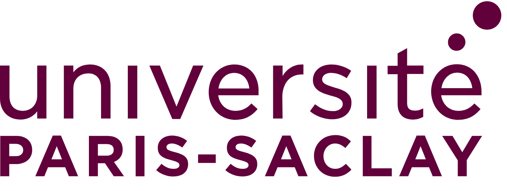
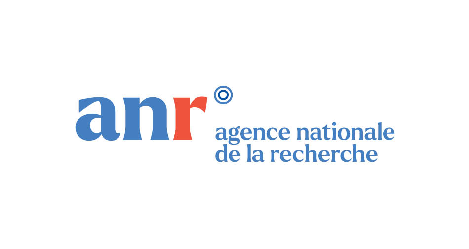

Acknowledgments and licence
===========================

Contributors
------------

Many people contributed to this library, either indirectly or directly.

By alphabetic order:

- François Boulogne
- Lorène Champougny
- Alice Etienne-Simonetti
- Jonas Miguet
- Marina Pasquet
- Emmanuelle Rio
- Anniina Salonen
- Victor Ziapkoff

Fundings
--------

This work has been funded by the ANR - 22-CE06-0029.

Licence
-------

This work a Free Libre Open-Source Software, released under the GNU General Public License v3.0.

The GNU GPLv3 grants users the freedom to use, modify, and distribute software, but requires that any derivative works remain open-source under the same license, preserving these rights for all downstream users.
It also explicitly states that the software comes with no warranty , protecting developers from liability.

Details are provided in the Licence file.
